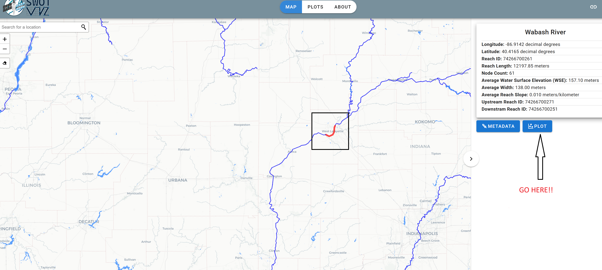
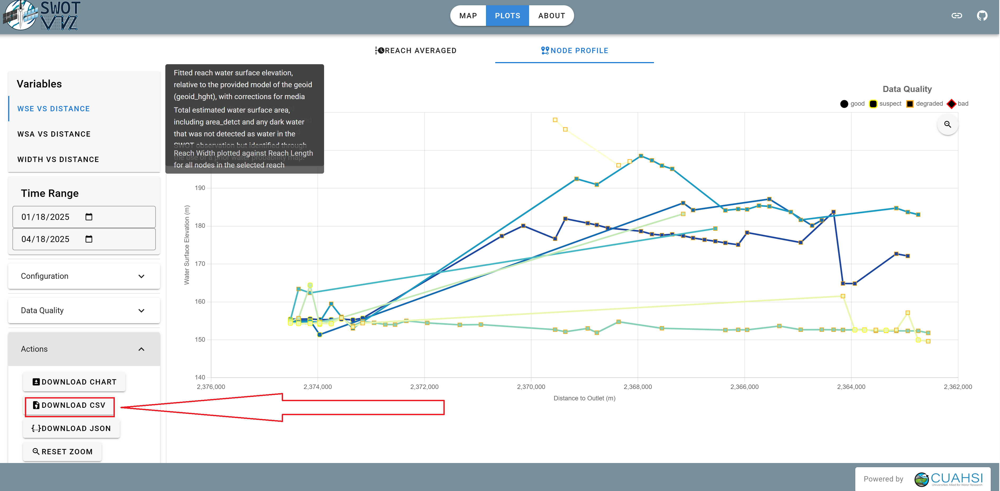

# River_Bathymetry_with_SWOT

This repository contains the code for analyzing river cross-sections using SWOT satellite data and generating visualizations of water surface elevation and width.

## Getting Started

To run the analysis code, you first need to set up a Python environment with the necessary libraries using Conda.

### Prerequisites

* **Conda:** Make sure you have Conda installed on your system. If not, you can download and install Miniconda or Anaconda from [https://docs.conda.io/projects/conda/en/latest/user-guide/install/index.html](https://docs.conda.io/projects/conda/en/latest/user-guide/install/index.html).
* **Git:** You'll need Git to clone this repository.

### Installation

1.  **Clone the Repository:** Open your terminal or command prompt and clone this repository to your local machine using the following command:

    ```bash
    git clone <https://github.com/ShishirBro/River_Bathymetry_with_SWOT.git>
    ```


2.  **Navigate to the Repository:** Change your current directory to the cloned repository:

    ```bash
    cd River_Bathymetry_with_SWOT
    ```

3.  **Create the Conda Environment:** This repository should contain an `bathymetry_env.yaml` file. Use it to create a new Conda environment with all the required dependencies:

    ```bash
    conda env create -f bathymetry_env.yaml
    ```

4.  **Activate the Conda Environment:** Activate the newly created environment:

    ```bash
    conda activate <rivbath>
    ```


### Running the Analysis

1.  **Open the Jupyter Notebook:** Launch Jupyter Notebook or JupyterLab from your terminal within the activated Conda environment:

    ```bash
    jupyter notebook
    # or
    jupyter lab
    ```

2.  **Navigate to the Notebook:** In the Jupyter file explorer, navigate to the `ENV_INF.ipynb` file.

3.  **Select the Kernel:** Open the `ENV_INF.ipynb` notebook. Go to the "Kernel" menu and select "Change kernel". Choose the Conda environment you just created (rivbath should appear on the list).

4.  **Run the Cells:** Run the cells in the notebook sequentially. The code will process the SWOT data, generate cross-sections, extract values, and produce plots.

## Using Your Own River Reach Data

You can apply this analysis to different river reaches by downloading data from the SWOT Virtual Observatory:

1.  **Go to the SWOT Virtual Observatory:** Visit [https://swotvis.cuahsi.io/#/map](https://swotvis.cuahsi.io/#/map).
2.  **Select Your River Reach:** Navigate to your area of interest on the map and select the river reach you want to analyze.
    
3.  **Plot the Data:** Click on the "Plot" button.
    

4.  **Download Data:** Go to the "Actions" panel on the bottom left and click on the download options for the data you need (e.g., SWOT River Reach/Node data, potentially associated raster products if available). Download the CSV files.
5.  **Replace Data:** Move the downloaded CSV files into the appropriate directory within this repository (ensure they match the filenames expected by the notebook, or update the filenames in the notebook). You might also need to update the path to these csv files.
6.  **Run the Code:** Run the `ENV_INF.ipynb` notebook again with the newly downloaded data to generate cross-sections and plots for your chosen river reach.

---

